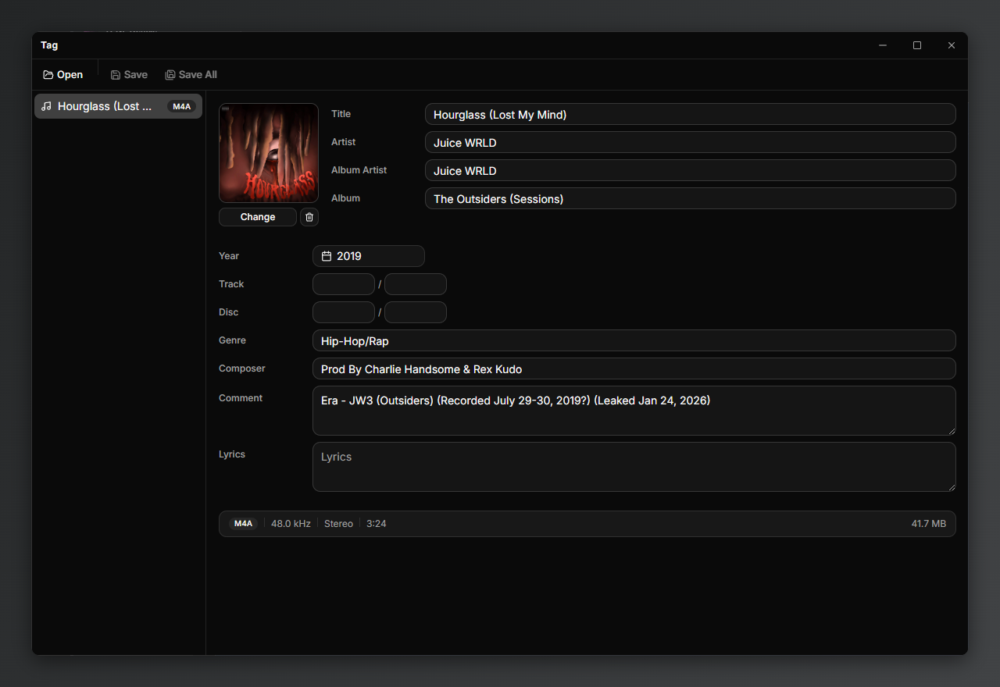

# tag

a simple audio metadata editor. open your mp3, wav, or m4a files, edit the tags, save. that's it.



## features

- read and write tags for mp3, wav, and m4a
- album art — view, change, or remove cover images
- multi-select — ctrl/shift click to select multiple files and batch edit them at once
- drag and drop files directly into the app
- right-click context menu for quick save/remove
- date picker for the year field
- registers as a "open with" handler on windows so you can right-click any audio file and edit its tags immediately
- dark mode (always on, no light mode, you're welcome)

## download

grab the latest build from [releases](../../releases). available for windows (installer + portable), macos (arm), and linux (appimage).

## dev

you'll need [bun](https://bun.sh) installed.

```
bun install
bun run dev
```

## building

```
bun run package:win
bun run package:mac
bun run package:linux
```

## stack

electron, react, vite, tailwindcss, shadcn, node-taglib-sharp

## license

mit
